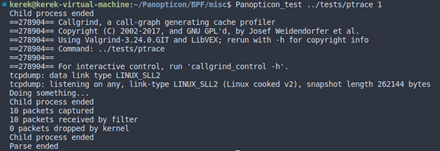
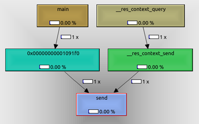
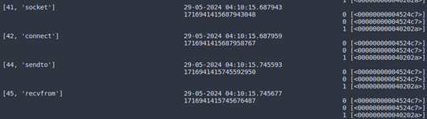
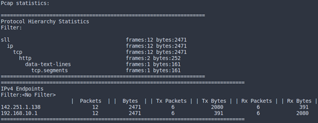

# Panopticon
## Monitor lifetime of a binary
### How to use?

1. Clone Panopticon using git:

```git clone https://github.com/KereKDereK/Panopticon_VKR```

2. Install dependancies (blazesym, libbpf, callgrind).
3. Build Panopticon:

```sudo <Panopticon_dir>/BPF/filters/build_main.sh```
4. Configure your system using script:

```sudo <Panopticon_dir>/BPF/misc/configure.sh```
5. Acquire data:

```Panopticon_test <path_to_binary> [callgrind_flag]```
6. Aggregate data:

```Panopticon_aggregate <session_id> [-v]```

### Usage example

1. Acquire data:


2. Analyze call graph:


3. Find suspicious symbol:


4. Analyze Panopticon output:


5. Analyze network usage:



